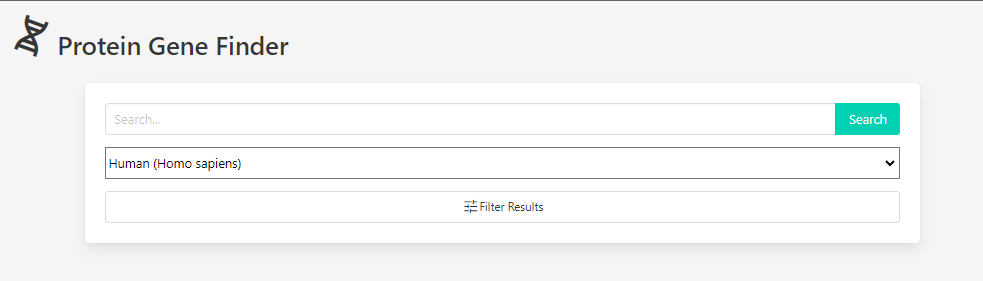
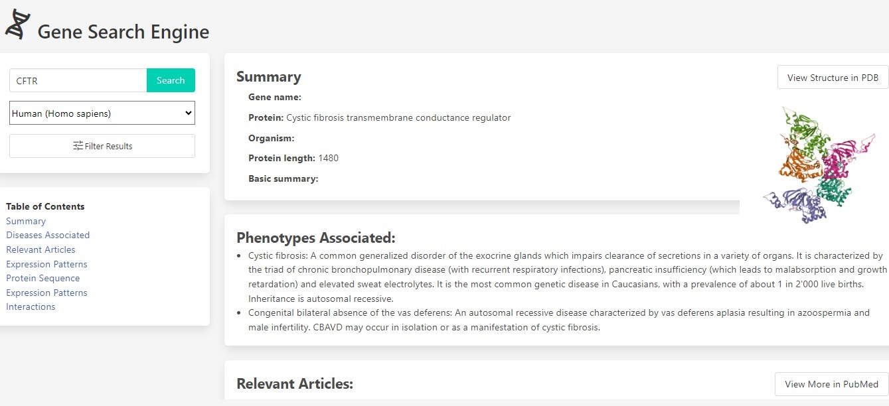
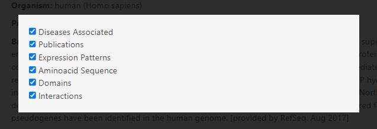
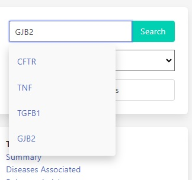

# Protein Gene Finder

https://leopoldogurgel.github.io/proteingenefinder/

## DESCRIPTION

The Protein Gene Finder is a powerful tool that uses server side APIs information to simplify the process of searching for protein genes and related genetic information. This repository contains the source code for the Protein Gene Finder application.

## RESOURCES

 - Gene Search: Easily search for genes by their name, disorders associated or tag words associated with them.
 - Comprehensive Information: Access detailed information well organized in a clear and easy to read Userfriendly Interface.
 - PubMed Integration: Your search will also bring the most recent articles pubished in PubMed DataBase.

## INSTRUCTIONS

1 - By accessing the webpage you will encounter a search form. In the text input you can search for a gene name, a genetic disease or a body tissue. By clicking on the dropdown menu, you can change the species related to your search. The default value is human.

2 - After clicking on the search button, the search form will move to the left side of the page and the information will show on the right.

.

3 - You can select what you want to see and what you want to hide in order to make your screen cleaner. Click on the filter results button. A modal box will appear and you can select what will be displayed on your screen.

4 - A list of the content displayed on your screen is located below the search form, so you can find what you are looking for without much effort.

5 - Your search will be saved in your browser and, whenever you click on the search input, your recent searches will be displayed for you.

## CREDITS

All information displayed is provided by:

UniProt Consortium: The Universal Protein Resource (UniProt) 2021.
Entrez: National Center for Biotechnology Information (NCBI) 2008.
Data API: Protein Data Bank (RCSB PDB) 2020.

## CONTRIBUTIONS

You are welcome to help if you have any ideas to improve our project! If you want to do so, just follow these steps:

1 - Fork the repository.
2 - Create a new branch for you new feature or bug fix.
3 - Make the changes you have in mind.
4 - Commit your changes and push them to your fork.
5 - Open a pull request detailing the changes you've made.

## LICENSE

MIT License

Copyright (c) [2023] [Leopoldo Gurgel Barroso Pimentel]

Permission is hereby granted, free of charge, to any person obtaining a copy
of this software and associated documentation files (the "Software"), to deal
in the Software without restriction, including without limitation the rights
to use, copy, modify, merge, publish, distribute, sublicense, and/or sell
copies of the Software, and to permit persons to whom the Software is
furnished to do so, subject to the following conditions:

The above copyright notice and this permission notice shall be included in all
copies or substantial portions of the Software.

THE SOFTWARE IS PROVIDED "AS IS", WITHOUT WARRANTY OF ANY KIND, EXPRESS OR
IMPLIED, INCLUDING BUT NOT LIMITED TO THE WARRANTIES OF MERCHANTABILITY,
FITNESS FOR A PARTICULAR PURPOSE AND NONINFRINGEMENT. IN NO EVENT SHALL THE
AUTHORS OR COPYRIGHT HOLDERS BE LIABLE FOR ANY CLAIM, DAMAGES OR OTHER
LIABILITY, WHETHER IN AN ACTION OF CONTRACT, TORT OR OTHERWISE, ARISING FROM,
OUT OF OR IN CONNECTION WITH THE SOFTWARE OR THE USE OR OTHER DEALINGS IN THE
SOFTWARE.
